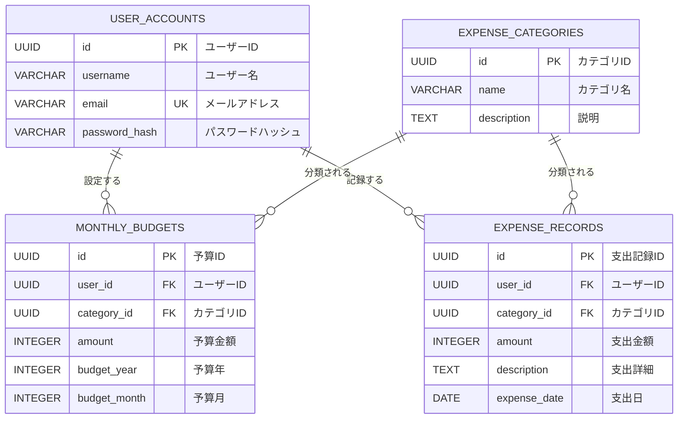

# データベース設計
- [データベース設計](#データベース設計)
  - [ER図](#er図)
  - [テーブル設計](#テーブル設計)
    - [1. ユーザーアカウント (user\_accounts)](#1-ユーザーアカウント-user_accounts)
    - [2. 支出カテゴリ (expense\_categories)](#2-支出カテゴリ-expense_categories)
    - [3. 月次予算 (monthly\_budgets)](#3-月次予算-monthly_budgets)
    - [4. 支出記録 (expense\_records)](#4-支出記録-expense_records)
  - [インデックス設計](#インデックス設計)
    - [パフォーマンス向上のための推奨インデックス](#パフォーマンス向上のための推奨インデックス)
  - [セキュリティ考慮事項](#セキュリティ考慮事項)
    - [1. 個人情報保護](#1-個人情報保護)
    - [2. アクセス制御](#2-アクセス制御)

## ER図



## テーブル設計

### 1. ユーザーアカウント (user_accounts)

| カラム名      | データ型     | 制約             | 説明               |
| ------------- | ------------ | ---------------- | ------------------ |
| id            | UUID         | PRIMARY KEY      | ユーザーID         |
| username      | VARCHAR(128) | NOT NULL         | ユーザー名         |
| email         | VARCHAR(256) | NOT NULL, UNIQUE | メールアドレス     |
| password_hash | VARCHAR(256) | NOT NULL         | パスワードハッシュ |

**制約**:
- email は一意制約
- password_hash は BBcrypt でハッシュ化されたパスワード

### 2. 支出カテゴリ (expense_categories)

| カラム名    | データ型     | 制約        | 説明         |
| ----------- | ------------ | ----------- | ------------ |
| id          | UUID         | PRIMARY KEY | カテゴリID   |
| name        | VARCHAR(128) | NOT NULL    | カテゴリ名   |
| description | TEXT         |             | カテゴリ説明 |

**マスターデータ例**:
- 食費
- 住居費
- 交通費
- 娯楽費
- 医療費
- 教育費
- その他

### 3. 月次予算 (monthly_budgets)

| カラム名     | データ型 | 制約         | 説明           |
| ------------ | -------- | ------------ | -------------- |
| id           | UUID     | PRIMARY KEY  | 予算ID         |
| user_id      | UUID     | NOT NULL, FK | ユーザーID     |
| category_id  | UUID     | FK           | カテゴリID     |
| amount       | INTEGER  | NOT NULL     | 予算金額（円） |
| budget_year  | INTEGER  | NOT NULL     | 予算年         |
| budget_month | INTEGER  | NOT NULL     | 予算月         |

**制約**:
- user_id は user_accounts テーブルの外部キー（CASCADE DELETE）
- category_id は expense_categories テーブルの外部キー（SET NULL）
- (user_id, category_id, budget_year, budget_month) の組み合わせは一意

### 4. 支出記録 (expense_records)

| カラム名     | データ型 | 制約         | 説明           |
| ------------ | -------- | ------------ | -------------- |
| id           | UUID     | PRIMARY KEY  | 支出記録ID     |
| user_id      | UUID     | NOT NULL, FK | ユーザーID     |
| category_id  | UUID     | FK           | カテゴリID     |
| amount       | INTEGER  | NOT NULL     | 支出金額（円） |
| description  | TEXT     |              | 支出詳細       |
| expense_date | DATE     | NOT NULL     | 支出日         |

**制約**:
- user_id は user_accounts テーブルの外部キー（CASCADE DELETE）
- category_id は expense_categories テーブルの外部キー（SET NULL）

## インデックス設計

### パフォーマンス向上のための推奨インデックス

```sql
-- 支出記録の検索パフォーマンス向上
CREATE INDEX idx_expense_records_user_date ON expense_records(user_id, expense_date);
CREATE INDEX idx_expense_records_category ON expense_records(category_id);

-- 月次予算の検索パフォーマンス向上
CREATE INDEX idx_monthly_budgets_user_period ON monthly_budgets(user_id, budget_year, budget_month);

-- ユーザー認証のパフォーマンス向上
CREATE INDEX idx_user_accounts_email ON user_accounts(email);
```

## セキュリティ考慮事項

### 1. 個人情報保護
- パスワードは必ずハッシュ化して保存

### 2. アクセス制御
- ユーザーは自分のデータのみアクセス可能
- API レベルでの認可チェック
